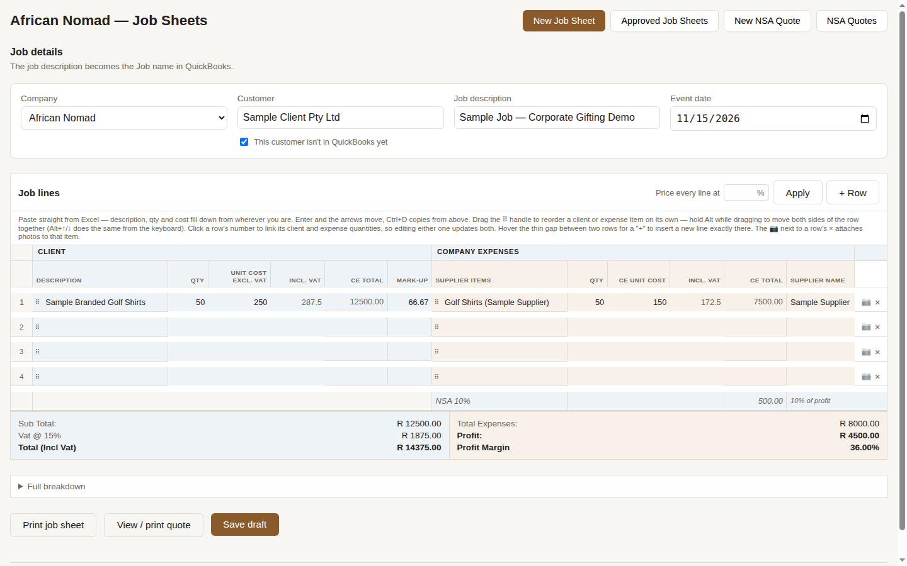
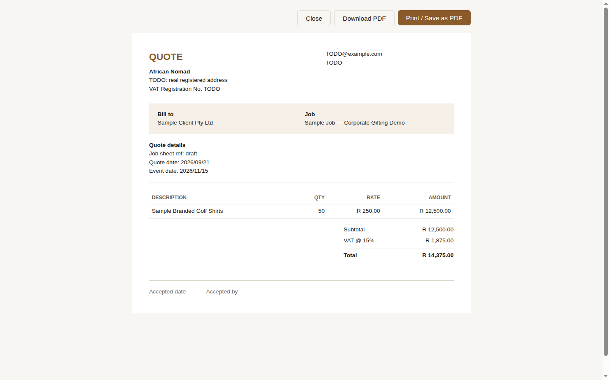
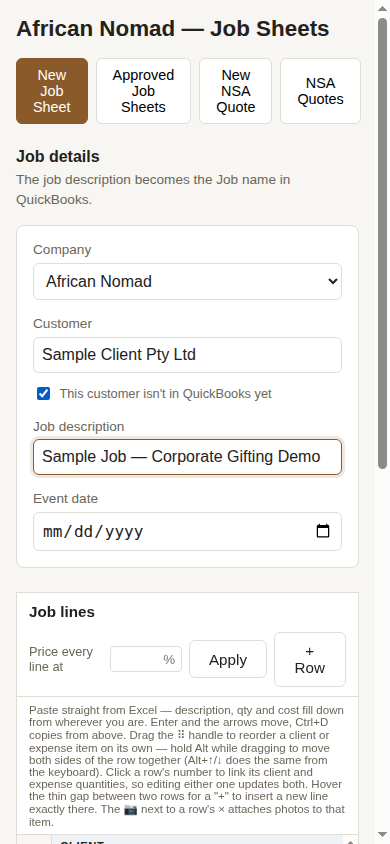

# Job Sheet & QuickBooks Automation System

A production web application that replaces a spreadsheet-based job-costing
process with a structured quoting, approval and accounting pipeline, and syncs
approved work into QuickBooks — both **Desktop** (via a SOAP/qbXML bridge) and
**Online** (via OAuth 2.0 and the REST API).

Built for a South African supply and services business operating across mining
supply, catering, corporate gifting and events.

---

## Overview

The business quotes and delivers jobs for large industrial clients. Each job has
two financial sides that must be tracked together and must never disagree: what
the client is charged, and what the job actually costs to deliver — supplier
lines, rebates, partner fees and VAT.

Before this system, that was a single inherited Excel workbook, copied per job,
full of manual formulas and hard-coded cells. It produced client paperwork, it
drove what got invoiced, and it was the only record of margin on a job.

This application replaces the workbook end to end and pushes the result into the
accounting system, without changing how the team actually works: the main screen
is still a spreadsheet-shaped grid, with two column blocks side by side.

*Client details have been generalised throughout this document. The application
itself reads all client-identifying letterhead, tax and banking information from
environment variables rather than source — see [Configuration](#configuration).*

## The problem

1. **The workbook had no integrity guarantees.** Two documents generated from
   the same job could — and once did — disagree on the client total, because a
   deduction was applied to one side and not the other. There was nothing to
   catch it.
2. **The margin cascade was invisible.** Partner fees, a client-specific rebate,
   and VAT interact in a specific order. Applying them in the wrong order
   changes the reported profit on a job without changing anything visible.
3. **Nothing reached the accounts automatically.** Every approved job was
   re-keyed into QuickBooks by hand.
4. **QuickBooks Desktop has no REST API and no webhooks.** The only supported
   integration path is qbXML over SOAP, polled outbound by the QuickBooks Web
   Connector running on the same Windows machine as the company file. Nothing
   can be pushed to it from the cloud.
5. **Client-facing paperwork has different letterhead requirements** from the
   internal record of the same job — the two documents must be generated from
   one source of truth but must not look alike.

## The solution

A single React application over a Postgres (Supabase) database, with the
financial cascade implemented once, in tested application code, and reused by
every document and every sync path.

- One job sheet produces both the internal costing record and the client-facing
  quote/invoice, so the two cannot drift.
- Approval — an explicit human step — is what creates accounting work. Nothing
  reaches QuickBooks without it.
- Two independent sync paths cover both QuickBooks products: a self-hosted SOAP
  bridge for Desktop, and OAuth 2.0 serverless functions for Online.

---

## Key features

**Job sheet entry**
- Spreadsheet-style grid with keyboard navigation, multi-cell paste from Excel,
  drag-to-reorder (independently per side, or both sides locked together),
  inline row insertion, and linked client/expense quantities.
- Live margin calculation as you type, with a soft visual flag on thin margins
  rather than a hard block.
- Reverse pricing: set a target mark-up percentage and have the client unit cost
  solved back from it, or see the maximum supplier total a given mark-up allows.
- Photo attachments per line item, stored in Supabase Storage.

**Financial engine**
- VAT, partner fee, and client-rebate cascade implemented in
  `src/lib/feeCalculations.ts` and covered by 165 unit tests, including tests
  that assert two real reference documents reproduce to the cent, and tests
  whose entire job is to fail if the client-facing total and the internal total
  ever stop agreeing.
- Profit-share fees floor at zero — a loss-making job pays no partner fee rather
  than a negative one.

**Documents**
- Three separately-styled print documents from one record: the client quote, the
  client invoice (which additionally renders banking details), and the internal
  job sheet.
- Client-side PDF generation, with the PDF library dynamically imported so it is
  not in the initial bundle.

**Approvals and sync**
- Approval view listing drafts and approved sheets, with edit, delete-draft, and
  convert-to-invoice paths.
- Approval writes to a sync queue; the queue is what the QuickBooks integrations
  consume.

**QuickBooks Online**
- Full OAuth 2.0 authorization-code flow with CSRF state verification, automatic
  token refresh ahead of expiry, and token revocation on disconnect.
- Customer/sub-customer mirror synced from the connected company, so the quote
  form offers real customers instead of free text.
- Estimate and Invoice creation, with QuickBooks' own document numbering written
  back to the local record.

**QuickBooks Desktop bridge**
- A standalone Express service implementing the QuickBooks Web Connector SOAP
  contract (`authenticate`, `sendRequestXML`, `receiveResponseXML`,
  `closeConnection`, `connectionError`, `getLastError`).
- Builds qbXML for `CustomerAdd`, `CustomerQuery`, `ItemServiceAdd`,
  `VendorAdd`, `EstimateAdd`, `InvoiceAdd` and `BillAdd`, auto-creating missing
  list entities on first sync.
- Session state machine where a step can spawn follow-up steps — e.g. a
  `CustomerAdd` that hits a duplicate spawns a `CustomerQuery` to recover the
  existing `ListID` and continue.

**Progressive web app**
- Installable, with a Workbox service worker. The navigation fallback explicitly
  excludes `/api/` and `/legal/`, without which the service worker would serve
  the cached app shell to the OAuth redirect and the consent flow would silently
  never happen.

---

## Tech stack

| Layer | Technology |
|---|---|
| Frontend | React 18, TypeScript (strict), Vite 8 |
| Styling | Hand-written CSS, no framework |
| PWA | `vite-plugin-pwa` / Workbox |
| Database | Supabase (PostgreSQL, Row Level Security, Storage) |
| Serverless API | Vercel Functions (`@vercel/node`) |
| QuickBooks Online | Intuit OAuth 2.0 + Accounting REST API v3 |
| QuickBooks Desktop | Node + Express + SOAP + qbXML (`fast-xml-parser`) |
| PDF | `html2pdf.js`, dynamically imported |
| Tests | Vitest (165 tests) |
| Lint | ESLint 9 flat config, typescript-eslint, react-hooks, jsx-a11y |
| Automation | n8n (webhook → push workflow) |
| Hosting | Vercel (app + API), Render (bridge), Supabase (database) |

---

## Architecture

```
                    ┌───────────────────────────┐
                    │  React PWA  (Vercel)      │
                    │  job sheets, quotes,      │
                    │  approvals, PDF documents │
                    └─────────────┬─────────────┘
                                  │ supabase-js (anon key, RLS)
                    ┌─────────────▼─────────────┐
                    │  Supabase PostgreSQL      │
                    │  job_sheets, nsa_quotes,  │
                    │  qbd_sync_queue,          │
                    │  qbo_connections, storage │
                    └──────┬─────────────┬──────┘
         service-role key  │             │  service-role key
              ┌────────────▼───┐   ┌─────▼──────────────────┐
              │ Vercel         │   │ QBD Bridge (Render)    │
              │ api/qbo/*      │   │ Express + SOAP         │
              │ OAuth2 + REST  │   │ qbXML                  │
              └────────┬───────┘   └─────────▲──────────────┘
                       │                     │ polls outbound
              ┌────────▼───────┐   ┌─────────┴──────────────┐
              │ QuickBooks     │   │ QuickBooks Web         │
              │ Online         │   │ Connector → QB Desktop │
              └────────────────┘   └────────────────────────┘
```

**Repository layout**

```
src/            React application
  components/   Forms, spreadsheet grid, approval view, print documents
  lib/          All Supabase access and all financial logic — components
                never call Supabase directly
api/            Vercel serverless functions
  _lib/         Shared Intuit OAuth + QBO REST client
  qbo/          connect, callback, disconnect, launch, push, sync
bridge/         QuickBooks Desktop Web Connector service (own package.json)
  src/qbxml/    Request builders, response parsers, XML escaping
  src/session   The QBWC session state machine
supabase/       SQL migrations, including RLS policies
n8n-workflows/  Exported automation workflow definitions
```

Two conventions are enforced throughout:

1. **All database access is funnelled through `src/lib/`.** No component calls
   Supabase directly.
2. **The financial cascade exists in exactly one place.** Documents and sync
   paths consume it; none of them re-implement it.

---

## Engineering highlights

**The cascade correctness tests.** `src/lib/feeCalculations.test.ts` and
`nsaQuotes.test.ts` don't just test arithmetic — they encode the business
invariant that the client-facing document and the internal record must report
the same client total, and reproduce two real historical documents exactly.
That pair of suites exists because the invariant was broken once in production.

**OAuth CSRF handling.** `api/qbo/connect.ts` stores a one-time `state` in an
`HttpOnly; Secure; SameSite=Lax` cookie scoped to `/api/qbo`, and
`api/qbo/callback.ts` compares Intuit's returned `state` against it rather than
merely checking that some value is present. `SameSite=Lax` specifically, because
the cookie must still be sent on the top-level GET navigation back from Intuit.
The cookie is cleared on every outcome, so an abandoned attempt can't be
replayed against a later one.

**Token lifecycle.** Access tokens are refreshed when within two minutes of
expiry, the rotated refresh token is persisted, and a failed refresh is
translated into an actionable "reconnect" message rather than Intuit's raw
error — because a dead refresh token is the one failure retrying cannot fix.

**Retry discipline.** `fetchWithRetry` retries network throws and 5xx only. A
4xx is returned immediately: re-sending an identical request that the server
already rejected will be rejected identically. Intuit's `intuit_tid` request
identifier is captured into both logs and thrown errors, because it is what
Intuit's own support needs to trace a failure.

**The qbXML session machine.** QuickBooks Desktop has no transactions across
requests, so the bridge models a sync as an ordered list of steps where handling
one response can push new steps onto the queue — recovering an existing
`ListID` after a duplicate-name `CustomerAdd`, or creating a missing service
item before the estimate that references it.

**Service-worker / OAuth interaction.** Documented in `vite.config.ts`: the PWA
navigation fallback had to exclude `/api/` and `/legal/`, mirroring the Vercel
rewrite rule, or the OAuth redirect resolves from cache and never reaches the
network.

**Stale-mirror cleanup.** The customer sync computes the stale set client-side
(fetch ids, diff, `.in()` delete) rather than building a `not.in` filter string,
after the hand-built filter was found to silently match nothing — leaving the
mirror able only to grow.

---

## Screenshots

### Job sheet grid



### Quote document



### Mobile



All data shown is placeholder ("Sample Client Pty Ltd", fake line items) typed in
locally and never saved — this app reads live production data with no login wall, so
the real approvals/quotes lists aren't screenshotted to avoid exposing real client
names and figures.

---

## Running locally

**Prerequisites:** Node.js 22 or later (`@supabase/supabase-js` deprecates Node
20 and `realtime-js` requires a native `WebSocket`), npm, and a Supabase project.

```bash
git clone https://github.com/<owner>/<repo>.git
cd <repo>
npm install

cp .env.example .env.local
# Fill in .env.local — see Configuration below. Never commit it.

npm run dev            # http://127.0.0.1:5173
```

**Database.** Apply `supabase/migrations/*.sql` in filename order to your
Supabase project, via the Supabase CLI or the SQL editor.

**QuickBooks Desktop bridge** (optional — only needed for the Desktop path):

```bash
cd bridge
npm install
cp .env.example .env
npm run dev            # http://localhost:8080
npm run qwc            # regenerates the .qwc file for the Web Connector
```

Then add the generated `.qwc` file in QuickBooks Web Connector on the Windows
machine running QuickBooks Desktop.

### Configuration

Every variable is listed with a safe placeholder in `.env.example`. Two things
are worth knowing:

- Anything prefixed `VITE_` is **inlined into the browser bundle** at build time
  and is therefore public. Only the Supabase anon key and the document
  letterhead belong there.
- `SUPABASE_SERVICE_ROLE_KEY` bypasses Row Level Security. It is server-side
  only, used by `api/qbo/*` and the bridge, and must never receive a `VITE_`
  prefix.

The client-facing document letterhead (company name, address, VAT number,
contact details and banking details) is read from `VITE_NSA_*` variables rather
than hard-coded, so this repository can be published without disclosing a third
party's business details. Unset variables render as blank lines rather than
throwing; an empty `VITE_NSA_BANK_NAME` suppresses the banking block entirely.

---

## Testing and quality

```bash
npm run typecheck   # tsc across all three tsconfigs: src, api, bridge
npm run lint        # ESLint 9 flat config
npm test            # Vitest — 165 tests
npm run build       # production build (typechecks first)

npm run check       # all four, in order
```

The test suite concentrates where correctness actually matters: the fee cascade,
job-sheet row mapping, mark-up maths, quote/job-sheet agreement, qbXML request
building, qbXML response parsing, the SOAP envelope, and the Web Connector
session state machine. UI rendering is not unit tested.

The bridge carries its own `vitest.config.ts` so it can be tested standalone
from `bridge/`; the root `npm test` covers both packages in one run.

---

## Deployment

| Component | Platform | Notes |
|---|---|---|
| React app + `api/` | Vercel | Git push to `master` deploys. `vercel.json` rewrites everything except `/api/` and `/legal/` to the SPA shell. |
| QBD bridge | Render | `render.yaml` is a Blueprint with `rootDir: bridge`, a `/health` check, and all non-secret env vars pre-filled. Secrets are `sync: false` and set in the dashboard. |
| Database | Supabase | Migrations applied in filename order. |
| Automation | n8n | `n8n-workflows/` holds exported definitions; the instance is shared, so the workflows are additive. |

The bridge is deliberately a separate Render service rather than being bolted
onto the existing automation instance, so restarting one never disturbs the
other.

---

## What I built

I designed and implemented this system end to end: the database schema and RLS
policies, the React application, the financial engine and its test suite, both
QuickBooks integrations, and the deployment configuration for all three hosted
components.

Work this project demonstrates:

- Decoding an undocumented, formula-driven Excel workbook into a specified,
  tested financial model — including reconciling against real historical
  documents to confirm the decoded cascade was correct.
- Implementing an OAuth 2.0 authorization-code flow against a third-party
  accounting API, with CSRF protection, token rotation and revocation.
- Implementing a SOAP/qbXML service against QuickBooks Desktop's Web Connector
  contract, including the session state machine and entity auto-creation.
- Schema design and Row Level Security policy authoring in PostgreSQL.
- Building a spreadsheet-grade data-entry UI — keyboard grid navigation,
  clipboard paste from Excel, drag reorder — because matching the team's
  existing workflow was a requirement, not a nice-to-have.
- Diagnosing integration failures that only appear in production: a service
  worker intercepting an OAuth redirect, a filter string that silently matched
  nothing, a locale-dependent decimal separator rejected by QuickBooks.

Development was assisted by AI coding tools. The architecture, the financial
model, the integration design and the debugging were mine; the tooling
accelerated the writing.

### Known limitations

Called out honestly rather than hidden:

- **There is no user authentication.** The application is single-tenant and
  internal, and Row Level Security grants the `anon` role read/write access. Any
  multi-user or externally-exposed deployment needs Supabase Auth and
  per-user policies first.
- **The `api/qbo/push-*` and `api/qbo/sync-*` endpoints are unauthenticated.**
  They are invoked by a trusted automation workflow. They need a shared secret
  or signed request before being exposed more widely.
- **`supabase/migrations/` includes a supplier-sourcing schema** that was merged
  in from an earlier project so both could share one database. Its frontend does
  not live in this repository. The migrations are retained because applied
  migrations must never be deleted.
- **Several library functions have no current caller** — file attachments, sync
  retry, and convert-to-invoice helpers in `src/lib/jobSheets.ts` — left in
  place because the tables and RPCs behind them are live.
- **The PDF chunk is large** (~936 KB). It is dynamically imported, so it stays
  out of the initial bundle, but it is not code-split further.

---

## License

Private and unlicensed. Published for portfolio review; not offered for reuse.
